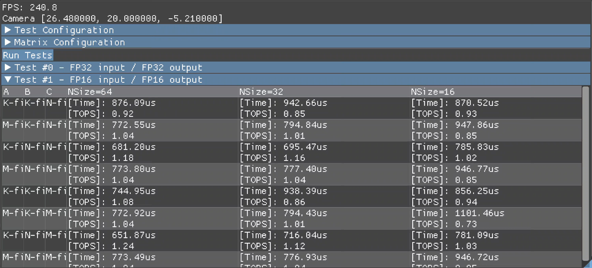

# Cooperative matrix sample



Runs matrix operations on supported Adreno™ GPUs using `VK_KHR_cooperative_matrix`. The application queries supported tile sizes and component types before creating a workload.

The default layout comparison measures alternative input layouts. The UI also exposes custom layouts and legacy tests. Validate GPU output against the CPU reference before interpreting timings. Available cases, including Qualcomm™-specific paths, depend on device capabilities.

## Build and run

Follow the [framework setup](../../README.md#configuring), select `cooperative_matrix`, and build the target platform. Use the [run instructions](../../README.md#running) for installation, working directories, and configuration.

## Layout and execution rules

Both GEMM kernels compute `R = A × B`, with A shaped M×K and B shaped K×N. They start the accumulator at zero. The C binding is reserved and is not added to the result.

The default comparison uses Tiled K-first inputs, with TILE_K contiguous elements per row of each tile. A uses `row * TILE_K + step * TOTAL_M`; B uses `col * TILE_K + step * TOTAL_N`. M-first A, N-first B, and both output layouts remain in the table to measure their tradeoffs. Select **Legacy K-first comparison** to measure plain K-first input layouts. C and R have M and N axes, so their layouts are named M-first or N-first.

For non-tiled matrices, the allocator adds 64 bytes when the line stride is a multiple of 128 bytes. Tiled inputs need no line padding. Input packing always follows the selected layout, regardless of whether validation is enabled.

The Adreno workgroup baseline is 64×2×2 invocations, covering two subgroup tiles in M and two in N. Tile sizes and types must match a queried, non-saturating subgroup property. Dispatch limits and subgroup controls are checked before a test is created. Defaults cover M512×N384, with K1024 for FP32, K2048 for FP16, and K4096 for signed and unsigned INT8. The three N tiles are 64, 32, and 16. Other devices can expose different tile sizes; record the actual dimensions printed with each result.

Vector-to-matrix GEMM requires the QCOM conversion feature and a 64-lane subgroup with one lane per tile row. It supports the same layouts as basic GEMM. Convolution uses channels-contiguous input, a 3×3 filter, stride 1, dilation 1, and zero padding. It checks signed coordinates before loading edge pixels. Its fixed K-first input/filter and N-first output layouts follow the implicit im2col access pattern.

CPU validation covers all three kernels. Integer results must match exactly; floating-point comparisons reject non-finite values and use the displayed tolerance. Validation runs outside the GPU timing interval. One untimed dispatch warms each pipeline before measured repetitions.

The start timestamp waits at the compute stage after the preceding dispatch dependency. This prevents the first measured interval from including unfinished warmup work. Timings report the average dispatch interval, excluding input layout conversion and uploads.

Vector-to-matrix GEMM loads contiguous FP16 and INT8 A inputs as packed 32-bit words for QCOM conversion. It gathers and packs strided M-first INT8 input; M-first FP16 and FP32 retain typed loads. Basic GEMM continues to use direct cooperative loads; compare the paths on the target driver before choosing one for an application.

Peak percentage is disabled by default. To use it, supply documented peak TOPS for the tested device and datatype at the stated frequency. The sample does not infer theoretical throughput from a GPU name or from another device's measured table. Compare published tables only with matching dimensions, layouts, tile sizes, driver, and measured GPU and memory frequencies. Large tiles and a 2×2 workgroup are starting points; they do not by themselves prove peak occupancy.

## Unattended checks

The sample reads these optional settings from `app_config.txt`. Values have no trailing semicolons.

```text
gCoopAutoRun = true
gCoopValidate = true
gCoopRepeats = 32
gCoopTest = 0
gCoopLegacyLayouts = false
gCoopKBlocks = 128
```

`gCoopTest` selects basic GEMM with 0, vector-to-matrix GEMM with 1, or convolution with 2. `gCoopKBlocks` selects 1 through 128 accumulation tiles; use 128 for the default workloads and a smaller value for quick correctness checks. Each completed test logs `COOP_RESULT`, including dimensions, layouts, tile, time, TOPS, and validation status. `COOP_SESSION_DONE` marks completion; unsupported tests are skipped, so also check the number of result records. Clock controls remain external to the sample.
