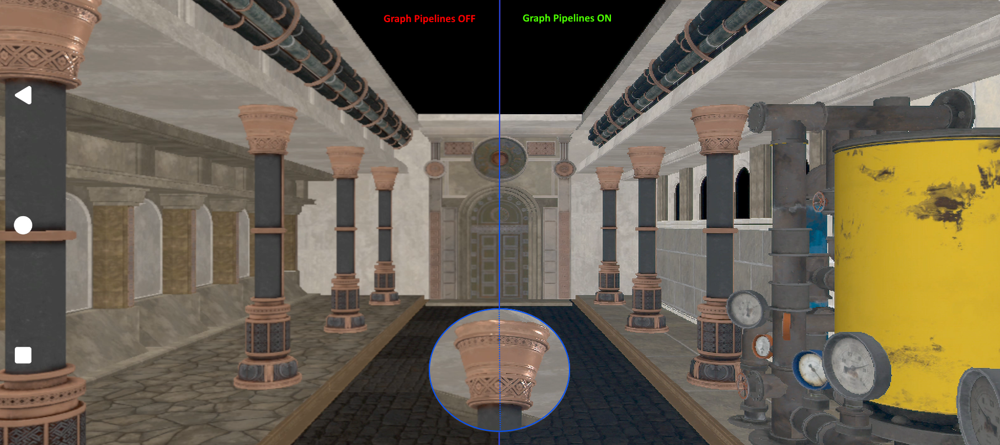

# Graph Pipelines Sample

This sample demonstrates the use of **Vulkan Graph Pipelines (Data Graph)** to execute a compute graph as a first‑class pipeline within a Vulkan application.

The goal of the sample is to show how graph‑based workloads (such as ML inference) can be created, bound, and dispatched using Vulkan’s data‑graph pipeline model.

Uses the *[VK_QCOM_data_graph_model](https://docs.vulkan.org/refpages/latest/refpages/source/VK_QCOM_data_graph_model.html)* and *[VK_ARM_data_graph](https://docs.vulkan.org/refpages/latest/refpages/source/VK_ARM_data_graph.html)* extensions.

---

## What This Sample Shows

The sample focuses on the core mechanics required to run a data‑graph workload:

- Creating a **data‑graph pipeline** using an identifier‑based creation path
- Creating a **pipeline session** associated with the graph
- Querying session memory requirements and explicitly allocating and binding device memory
- Recording a graph dispatch inside a Vulkan command buffer
- Submitting the dispatch to a Vulkan queue using standard synchronization primitives

The code intentionally avoids higher‑level abstractions in order to clearly expose the Vulkan objects and flow involved.

---

## High‑Level Flow

At a high level, the sample follows this sequence:

1. Create a data‑graph pipeline (from a precompiled graph identifier or cache data)
2. Create a pipeline session for runtime execution
3. Query session bind requirements and allocate required memory
4. Bind allocated memory to the session
5. Record commands:
   - Bind the graph pipeline and descriptor set
   - Dispatch the graph
6. Submit the command buffer to a queue

This mirrors how graph execution would typically be integrated into a frame graph or task system.

## Running

- If you haven't already, setup the framework and build the code [instructions here](../../README.md#configuring)
- Running this sample has no special additional requirements [instructions here](../../README.md#running)
