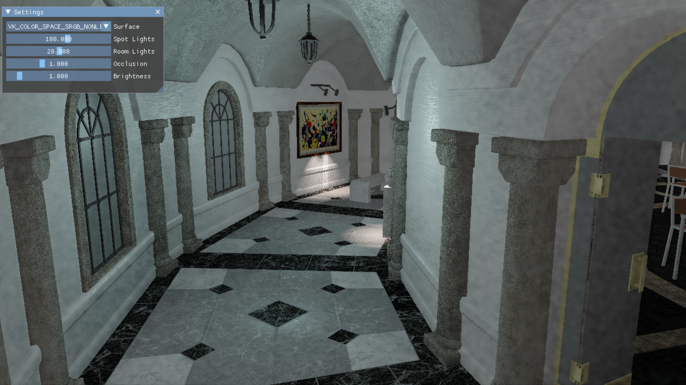

# HDR Swapchain

This sample demonstrates creating and presenting to an **HDR‑capable Vulkan swapchain**, showing how to select HDR formats/color spaces, render in HDR, and present with correct metadata for wide‑gamut, high‑luminance displays.

The app queries the surface for supported HDR formats and color spaces, builds an HDR swapchain, and renders with appropriate transfer functions and output transforms. If HDR is unavailable, it falls back to an SDR swapchain while preserving visual consistency across devices, including Adreno™ GPUs.

Uses the *[VK_QCOM_render_pass_transform](https://docs.vulkan.org/refpages/latest/refpages/source/VK_QCOM_render_pass_transform.html)* extension, if available.

## Running

- If you haven't already, setup the framework and build the code [instructions here](../../README.md#configuring)
- Running this sample has no special additional requirements [instructions here](../../README.md#running)
