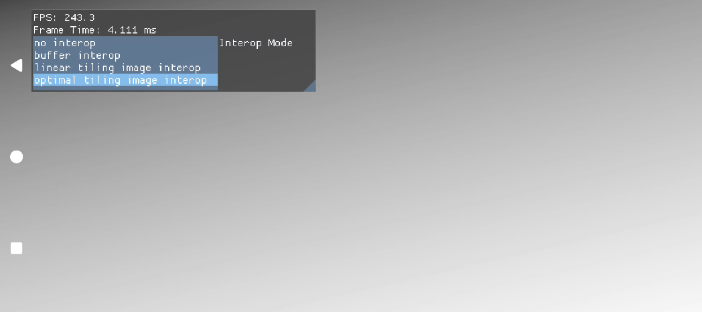

# OpenCL Interop Sample



This sample demonstrates Vulkan/OpenCL interoperability using external memory and semaphore synchronization.

The sample renders a simple Vulkan scene, shares image or buffer resources with OpenCL, runs an OpenCL grayscale kernel, and displays the processed result. It includes several interop modes that can be selected at runtime from the UI:

- no interop
- buffer interop
- linear tiling image interop
- optimal tiling image interop

The optimal image mode demonstrates importing Vulkan optimal tiling images into OpenCL with `CL_EXTERNAL_MEMORY_HANDLE_VULKAN_OPAQUE_FD_QCOM`. **For clarity, this sample keeps explicit Vulkan copies around the shared image resources rather than implementing a full render-target zero-copy path.**

## OpenCL SDK Headers

This sample requires Qualcomm OpenCL SDK headers at build time.

Download the Qualcomm Adreno OpenCL SDK from:

https://softwarecenter.qualcomm.com/catalog/item/Adreno_OpenCL_SDK

Copy the `CL` folder from:

```text
opencl-sdk/inc/CL
```

to:

```text
samples/opencl_interop/code/open_cl_common/CL
```

After copying, the following files required by this sample should exist:

```text
samples/opencl_interop/code/open_cl_common/CL/opencl.h
samples/opencl_interop/code/open_cl_common/CL/cl.h
samples/opencl_interop/code/open_cl_common/CL/cl_platform.h
samples/opencl_interop/code/open_cl_common/CL/cl_version.h
samples/opencl_interop/code/open_cl_common/CL/cl_ext.h
samples/opencl_interop/code/open_cl_common/CL/cl_ext_qcom.h
samples/opencl_interop/code/open_cl_common/CL/cl_gl.h
```

## Running

- If you haven't already, setup the framework and build the code [instructions here](../../README.md#configuring)
- This sample requires an Android device with OpenCL support and Vulkan/OpenCL external memory interoperability support.
- Running this sample otherwise follows the standard framework instructions [instructions here](../../README.md#running)