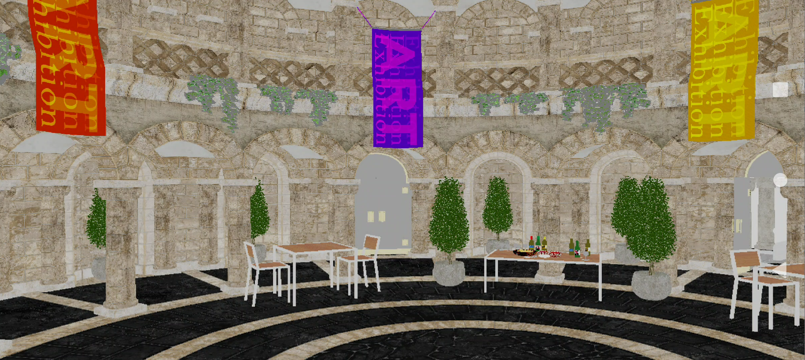

# Rotated copy sample

Uses `VK_QCOM_rotated_copy_commands` and `VK_KHR_copy_commands2` to copy an intermediate render target into the framebuffer with the device's display rotation.

The rotated copy path can avoid a separate display-composition rotation. It requires corresponding Vulkan extension support.

## Build and run

Follow the [framework setup](../../README.md#configuring), select `rotated_copy`, and build the target platform. Use the [run instructions](../../README.md#running) for installation, working directories, and configuration.
