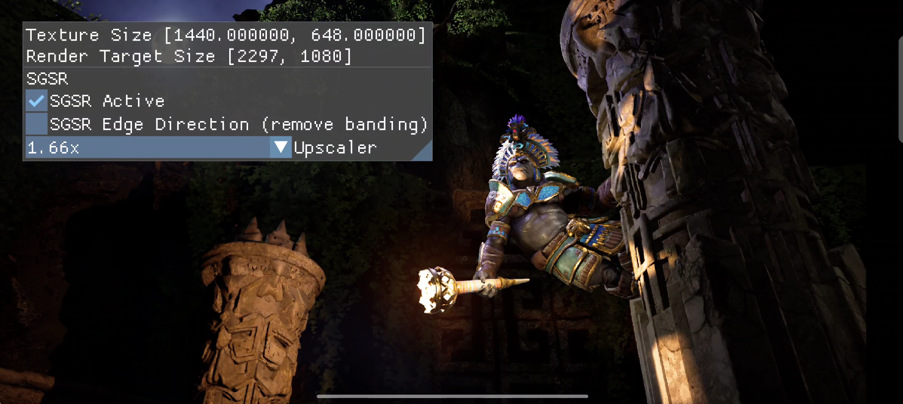

# Snapdragon™ Game Super Resolution sample

Compares [Snapdragon™ Game Super Resolution](https://github.com/SnapdragonGameStudios/snapdragon-gsr) with bilinear upscaling.

Use **SGSR Active** to switch Snapdragon™ GSR on or off. **SGSR Edge Direction** enables the optional edge-direction calculation used to reduce banding.

## Build and run

Follow the [framework setup](../../README.md#configuring), select `sgsr`, and build the target platform. Use the [run instructions](../../README.md#running) for installation, working directories, and configuration.
