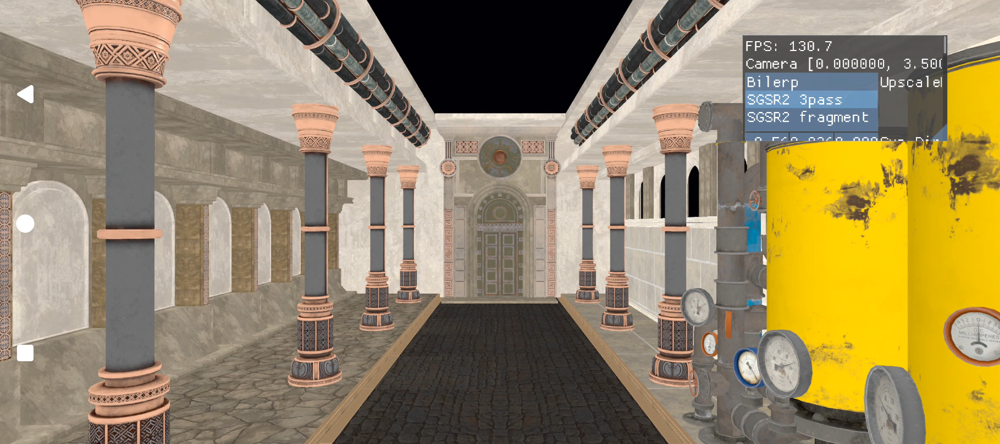

# Snapdragon™ Game Super Resolution 2

This sample demonstrates how to use [Snapdragon™ Game Super Resolution 2](https://github.com/SnapdragonGameStudios/snapdragon-gsr).

Snapdragon™ Game Super Resolution 2 (Snapdragon™ GSR 2 or SGSR 2) was developed by Qualcomm Snapdragon Game Studios. It's a temporal upscaling solution optimized for Adreno devices. It comes with 3 different variants (compute 3-pass is the one being demonstrated on this sample).