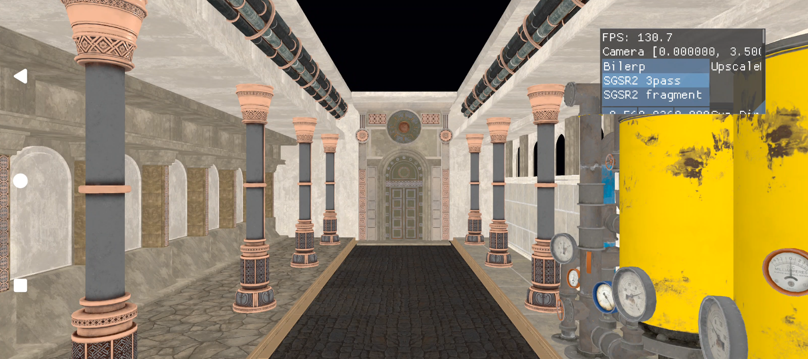

# Snapdragon™ Game Super Resolution 2 sample

Integrates the compute three-pass variant of [Snapdragon™ Game Super Resolution 2](https://github.com/SnapdragonGameStudios/snapdragon-gsr).

Snapdragon™ GSR 2 (SGSR 2) uses temporal inputs to reconstruct a higher-resolution image. Inspect the sample's motion-vector and jitter handling when adapting it to another renderer.

## Build and run

Follow the [framework setup](../../README.md#configuring), select `sgsr2`, and build the target platform. Use the [run instructions](../../README.md#running) for installation, working directories, and configuration.
