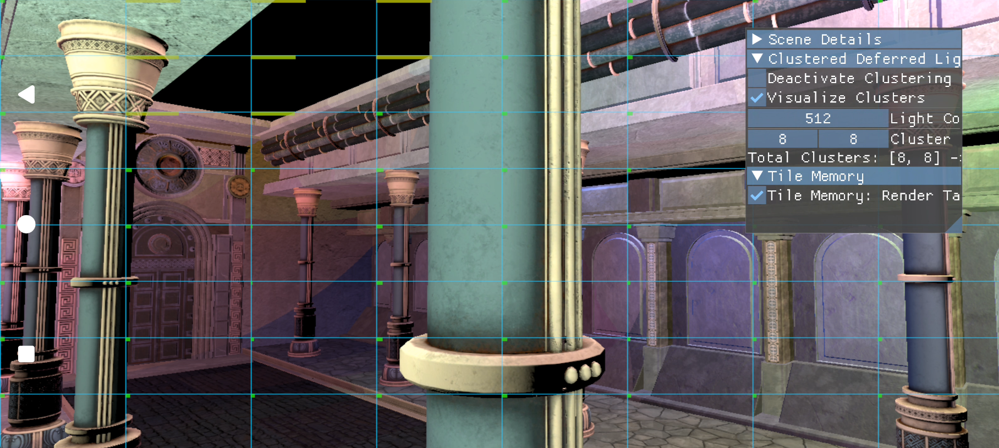

# Tile memory heap sample

Uses the Qualcomm™ extension `VK_QCOM_tile_memory_heap` in a clustered-lighting renderer on supported Adreno™ GPUs.

The application allocates resources from the tile memory heap and uses them within the extension's lifetime rules. Inspect allocation, binding, and submission boundaries before adapting the technique. The extension path requires compatible hardware and drivers.

## Build and run

Follow the [framework setup](../../README.md#configuring), select `tile_memory`, and build the target platform. Use the [run instructions](../../README.md#running) for installation, working directories, and configuration.
