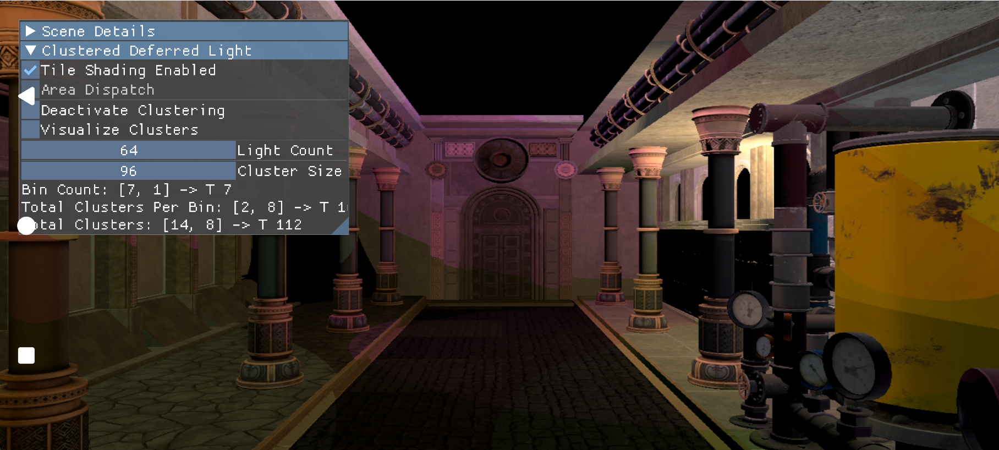

# Tile shading sample

Uses the Qualcomm™ extension `VK_QCOM_tile_shading` to perform rendering work within a tile-based render pass on supported Adreno™ GPUs.

Inspect extension setup and render-pass dependencies when following this path. It requires compatible hardware and driver support on the target Snapdragon™ platform. Tile shading and the separate `VK_QCOM_tile_memory_heap` sample demonstrate different Vulkan features.

## Build and run

Follow the [framework setup](../../README.md#configuring), select `tile_shading`, and build the target platform. Use the [run instructions](../../README.md#running) for installation, working directories, and configuration.
